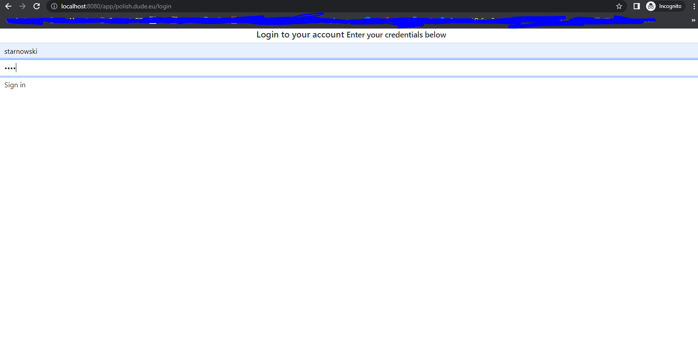

# Demo project for integration with Spring Boot, Thymeleaf and Posmulten-hibernate

* [Introduction](#introduction)
* [How to prepare database](#how-to-prepare-database)
* [How to build project](#how-to-build-project)
* [Fill database with data](#fill-database-with-data)
* [Run application](#run-application)
    ** [Login to application](#login-to-application)

## Introduction
Project is simple application with users that posts text content. 
The idea behind demo is that application use Multi-tenancy architecture with shared schema strategy.
Which means that all tenants shares not only the same database but also schemas.
In our example tenant is customer that has domain where his user posts text content.
[Posmulten-hibernate](https://github.com/starnowski/posmulten-hibernate) library required of using Postgres as database engine.

## How to prepare database
Project user Postgres database version. Minimum version is 9.6.
To create database users and schema execute below script from project in correct order:

- scripts/create-database-owner.sql
- scripts/create-database-user.sql
- scripts/create-database.sql

## How to build project
```bash
mvn clean install
```
**Important** it is worth to executed maven with test (without passing **-DskipTests=true** parameter) because the project does not use tools that apply changes to the database, like [Liquibase](https://www.liquibase.org/) or [Flyway](https://flywaydb.org/).
For this purpose, the project uses a test hibernates configuration that creates the schema we will describe later.
To be clear, in a regular project, we would consider using tools that apply database change so that generated SQL instructions could use in a production environment.
Hibernate tests configuration is a good solution for running tests, but configuration can also use to generate schema in our local environment.
We can use SQL statements generated by configuration in tools that apply changes in our higher environments.
 
## Fill database with data
The project does not have the import.sql file which would be imported by default by Hibernate configuration during tests.
Instead of that, there is a SQL file with the name MultiTenantContextAwareControllerTest-script.sql which can be used to fill a database with data.

# Run application
After filling a database with data, we can start the application via running maven CLI with Spring-boot goal, like below

```bash
mvn spring-boot:run
```

Quick note, we can also start applications via our favorite ide like Intellij or Eclipse, Netbeans!

## Login to application

Assuming that we used MultiTenantContextAwareControllerTest-script.sql file then we should available to log in with users from domains my.doc.com and polish.dude.eu.
So let's log in to polish.dude.eu domain with user 'starnowski'. All users from MultiTenantContextAwareControllerTest-script.sql have password 'pass'.

<p align="center">
  
</p>

Note, the CSS style can be harsh, but the UI part is not the most important thing for this demo.

## Checking users list

TODO

## Adding post

TODO

## Login to different domain

TODO

## Displaying post for different domain

TODO

# Code overview

TODO

## Hibernate configurations

TODO

### Main configuration

TODO

### Test configuration

TODO

## Http filters

TODO
