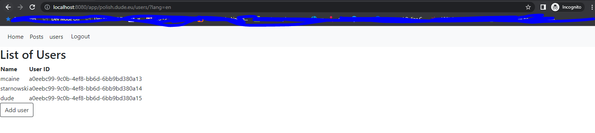

# Demo project for integration with Spring Boot, Thymeleaf and Posmulten-hibernate

* [Introduction](#introduction)
* [How to prepare database](#how-to-prepare-database)
* [How to build project](#how-to-build-project)
* [Fill database with data](#fill-database-with-data)
* [Run application](#run-application)
   * [Login to application](#login-to-application)
   * [Checking users list](#checking-users-list)
   * [Adding post](#adding-post)
   * [Login to different domain](#login-to-different-domain)
   * [Displaying post for different domain](#displaying-post-for-different-domain)
* [Code overview](#code-overview)
   * [Hibernate configurations](#hibernate-configurations)
       * [Main configuration](#main-configuration)
       * [Test configuration](#test-configuration)
   * [Http filters](#http-filters)

## Introduction
Project is simple application with users that posts text content. 
The idea behind demo is that application use Multi-tenancy architecture with shared schema strategy.
Which means that all tenants shares not only the same database but also schemas.
In our example tenant is customer that has domain where his user posts text content.
[Posmulten-hibernate](https://github.com/starnowski/posmulten-hibernate) library required of using Postgres as database engine.
The main goal of this demo is to show the benefits of Multi-tenancy architecture with a shared schema strategy.
How this architecture gives data isolation can reduce the enormous amount of code that developers would have to implement for authorization purposes.
For instance, in the assumption that data for all tenants are stored in one database, the developer does not have to implement conditions in every SQL query to ensure that one tenant does not see data that belongs to other tenants.

## How to prepare database
Project user Postgres database version. Minimum version is 9.6.
To create database users and schema execute below script from project in correct order:

- scripts/create-database-owner.sql
- scripts/create-database-user.sql
- scripts/create-database.sql

## How to build project
```bash
mvn clean install
```
**Important** it is worth to executed maven with test (without passing **-DskipTests=true** parameter) because the project does not use tools that apply changes to the database, like [Liquibase](https://www.liquibase.org/) or [Flyway](https://flywaydb.org/).
For this purpose, the project uses a test hibernates configuration that creates the schema we will describe later.
To be clear, in a regular project, we would consider using tools that apply database change so that generated SQL instructions could use in a production environment.
Hibernate tests configuration is a good solution for running tests, but configuration can also use to generate schema in our local environment.
We can use SQL statements generated by configuration in tools that apply changes in our higher environments.
 
## Fill database with data
The project does not have the import.sql file which would be imported by default by Hibernate configuration during tests.
Instead of that, there is a SQL file with the name MultiTenantContextAwareControllerTest-script.sql which can be used to fill a database with data.

# Run application
After filling a database with data, we can start the application via running maven CLI with Spring-boot goal, like below

```bash
mvn spring-boot:run
```

Quick note, we can also start applications via our favorite ide like Intellij or Eclipse, Netbeans!

## Login to application

Assuming that we used MultiTenantContextAwareControllerTest-script.sql file then we should available to log in with users from domains my.doc.com and polish.dude.eu.
So let's log in to polish.dude.eu domain with user 'starnowski'. All users from MultiTenantContextAwareControllerTest-script.sql have password 'pass'.

<p align="center">
  
</p>

Note, the CSS style can be harsh, but the UI part is not the most important thing for this demo.

## Checking users list

As a user with admin role we can check list of users 

<p align="center">
  
</p>

## Adding post

Checking current list of posts

<p align="center">
  
</p>

Adding new post for demo purpose

<p align="center">
  
</p>

Checking if post were added to list

<p align="center">
  
</p>

## Login to different domain

Lets try to log in to different domain

<p align="center">
  
</p>

## Displaying post for different domain

Checking posts for the domain.
We can observe that posts for the first domain are not being displayed.

<p align="center">
  
</p>

# Code overview

As for things in the code that might be interesting from the developers' perspective.
Packages like:

- com.github.starnowski.posmulten.demos.posmultenhibernate5springbootthymeleaf.dto
- com.github.starnowski.posmulten.demos.posmultenhibernate5springbootthymeleaf.forms
- com.github.starnowski.posmulten.demos.posmultenhibernate5springbootthymeleaf.mappers
- com.github.starnowski.posmulten.demos.posmultenhibernate5springbootthymeleaf.model
- com.github.starnowski.posmulten.demos.posmultenhibernate5springbootthymeleaf.repositories
- com.github.starnowski.posmulten.demos.posmultenhibernate5springbootthymeleaf.services
- com.github.starnowski.posmulten.demos.posmultenhibernate5springbootthymeleaf.security
- com.github.starnowski.posmulten.demos.posmultenhibernate5springbootthymeleaf.controllers

contains mostly business logic. 
So maybe besides usage of com.github.starnowski.posmulten.hibernate.core.TenantTable annotation in the model package you would not see any things that you would not see in other Spring-boot projects.

All configurations are being stored in com.github.starnowski.posmulten.demos.posmultenhibernate5springbootthymeleaf.configurations package.
What is interesting from a developer standpoint are two configurations, [PrimaryDataSourceConfiguration](#main-configuration), and [OwnerDataSourceConfiguration](#test-configuration) (this one in tests resources).
It is also recommended to check the WebSecurityConfig configuration. To find out how filters are defined, and in what order.
Or how handlers for login and logout were added. No to mention request matcher patterns. 

The [Http filters](#http-filters) are stored in com.github.starnowski.posmulten.demos.posmultenhibernate5springbootthymeleaf.filters package.

As for com.github.starnowski.posmulten.demos.posmultenhibernate5springbootthymeleaf.util package, the DomainResolver class might worth to check.

## Hibernate configurations

One of the most important configuration types for this project is JPA configuration.

### Main configuration

The com.github.starnowski.posmulten.demos.posmultenhibernate5springbootthymeleaf.configurations.PrimaryDataSourceConfiguration configuratiopn sets primary database component that will be used in production code.
As for database users, it can not be a user with an admin role from a Postgres database perspective.
Posmulten-hibernate library requires of usage of the Row Level Security policy mechanism that does not work for database admin users.

### Test configuration

The com.github.starnowski.posmulten.demos.posmultenhibernate5 springboot thymeleaf.configurations.OwnerDataSourceConfiguration configuration is design for tests purpose.
It should exists in the same Spring context as com.github.starnowski.posmulten.demos.posmultenhibernate5springbootthymeleaf.configurations.PrimaryDataSourceConfiguration configuratiopn.
Database user used by this configuration can be admin user or any other database that has priviliges to create function or add Row Level Security policies.

## Http filters

The com.github.starnowski.posmulten.demos.posmultenhibernate5 springboot thymeleaf.configurations.filters configuration contains Http filters object.
It is worth checking all of them, but the most important filter is CurrentTenantResolverFilter. 
It is responsible for setting the correct tenant identifiers based on a domain that is part of the URL address.


### Links

https://www.baeldung.com/spring-boot-3-spring-6-new


https://www.baeldung.com/spring-boot-3-migration

https://spring.io/blog/2022/02/21/spring-security-without-the-websecurityconfigureradapter


https://www.baeldung.com/htmlunit

https://blogs.perficient.com/2021/06/17/aws-cost-analysis-comparing-lambda-ec2-fargate/
https://blogs.perficient.com/2021/04/09/transitioning-your-infrastructure-to-architecture-as-code/

